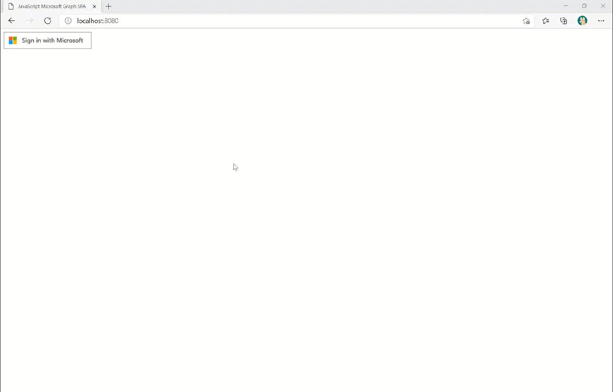

# A JavaScript application to retrieve Microsoft 365 data using Microsoft Graph 🚀

## Prerequisites

- [Node.js](https://nodejs.org/en/)
- [Visual Studio Code](https://code.visualstudio.com/)
- [Microsoft 365 Developer Tenant](https://developer.microsoft.com/en-us/microsoft-365/dev-program)

### Register Azure AD APP

You have to register an application in Azure Active Directory in order to run this application.
You could do it manually in the [Azure Portal](https://portal.azure.com/).

#### Register AAD app Manually in Azure Portal

1. [Register a new application](https://docs.microsoft.com/en-gb/azure/active-directory/develop/scenario-spa-app-registration) in the [Azure Portal](https://portal.azure.com/).
1. Ensure that the application is enabled for the [authorization code flow with PKCE](https://docs.microsoft.com/en-gb/azure/active-directory/develop/v2-oauth2-auth-code-flow). This will require that you redirect URI configured in the portal is of type SPA.
1. For this sample we will create a [single tenant application](https://docs.microsoft.com/en-us/azure/active-directory/develop/single-and-multi-tenant-apps)

### Configure the sample

- copy the value of the `Application (client) ID` of the newly registered application from Azure Portal. You can get this from the overview page of the newly registered application.
- in the `auth.js` file, on line 4, replace the value of the `clientId` property with the copied `Application (client) ID`
- Copying the value of the `Directory (tenant) ID` of the newly registered application from Azure Portal. You can get this from the overview page of the newly registered application.
- in the `auth.js` file, on line 6, replace the value of the `authority` property with the `Directory (tenant) ID` copied in above step, eg `https://login.microsoftonline.com/0be187e2-aa5c-464a-bc8b-74b0416b4c3a`, since this is a single tenant application.
- In case you created a multi-tenant application then comment out line 6 in `auth.js`. You don't need to pass the authority.

### Run the app

Run below command in the command line after moving to project folder to run the application in browser. The application will open in the port `8080` of localhost by default for npx. The option `-c-1` disables any caching.

```nodejs
npx http-server -c-1
```

  

# Contributing

This project welcomes contributions and suggestions.  Most contributions require you to agree to a
Contributor License Agreement (CLA) declaring that you have the right to, and actually do, grant us
the rights to use your contribution. For details, visit https://cla.opensource.microsoft.com.

When you submit a pull request, a CLA bot will automatically determine whether you need to provide
a CLA and decorate the PR appropriately (e.g., status check, comment). Simply follow the instructions
provided by the bot. You will only need to do this once across all repos using our CLA.

This project has adopted the [Microsoft Open Source Code of Conduct](https://opensource.microsoft.com/codeofconduct/).
For more information see the [Code of Conduct FAQ](https://opensource.microsoft.com/codeofconduct/faq/) or
contact [opencode@microsoft.com](mailto:opencode@microsoft.com) with any additional questions or comments.

# Legal Notices

Microsoft and any contributors grant you a license to the Microsoft documentation and other content
in this repository under the [Creative Commons Attribution 4.0 International Public License](https://creativecommons.org/licenses/by/4.0/legalcode),
see the [LICENSE](LICENSE) file, and grant you a license to any code in the repository under the [MIT License](https://opensource.org/licenses/MIT), see the
[LICENSE-CODE](LICENSE-CODE) file.

Microsoft, Windows, Microsoft Azure and/or other Microsoft products and services referenced in the documentation
may be either trademarks or registered trademarks of Microsoft in the United States and/or other countries.
The licenses for this project do not grant you rights to use any Microsoft names, logos, or trademarks.
Microsoft's general trademark guidelines can be found at http://go.microsoft.com/fwlink/?LinkID=254653.

Privacy information can be found at https://privacy.microsoft.com/en-us/

Microsoft and any contributors reserve all other rights, whether under their respective copyrights, patents,
or trademarks, whether by implication, estoppel or otherwise.